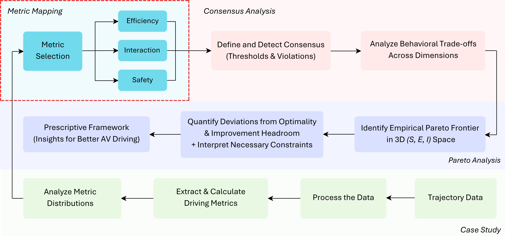

# Can Automated Vehicles Have it All? A Consensus Framework for Diagnosing Behavioral Trade-Offs in Mixed Traffic

This repository contains the code for the paper  
**“Can Automated Vehicles Have it All? A Consensus Framework for Diagnosing Behavioral Trade-Offs in Mixed Traffic”**  
(*Published in Transportation Research Part C*).

This repository implements a framework for evaluating how driving behavior balances **safety**, **interaction**, and **traffic efficiency**. The framework quantifies behavioral alignment (consensus) and trade-offs using high-resolution trajectory data.

The **Third Generation Simulation (TGSIM)** datasets (**Foggy Bottom** and **I-395**) are used as case studies to demonstrate how the framework captures these trade-offs in mixed traffic environments.

---

## Overview

This project implements a multi-dimensional evaluation framework that:
- Quantifies **behavioral consensus** across safety, efficiency, and interaction  
- Identifies **trade-offs** using an empirical Pareto representation  
- Supports comparison across different traffic contexts (urban vs. freeway)   

All computations and visualizations are performed through Jupyter notebooks.  
`.ipynb` files are provided here for transparency and reproducibility.

---

## Repository Contents

| File | Description |
|------|--------------|
| **[TGSIM_FB_Metrics.ipynb](./TGSIM_FB_Metrics.ipynb)** | Metric computation for the Foggy Bottom dataset, including TTC, PET, headway, jerk, deceleration, proximity time, yielding delay, hesitation and platoon gain analyses. |
| **[TGSIM_I-395_Metrics.ipynb](./TGSIM_I-395_Metrics.ipynb)** | Equivalent metric computation for the I-395 dataset, highlighting behavioral contrasts under highway conditions. |
| **[TGSIM_Consensus.ipynb](./TGSIM_Consensus.ipynb)** | Consensus quantification across safety, interaction, and efficiency dimensions using threshold-based alignment and UpSet-style visualizations. |
| **[Pareto.ipynb](./Pareto.ipynb)** | Derivation and visualization of the **Empirical Pareto Frontier**, showing trade-offs between behavioral objectives and identifying compliant versus non-compliant operating regimes. |

---

## Data Dependencies

### 1. Foggy Bottom Dataset
Available publicly from the U.S. Department of Transportation’s Data Catalog:  
➡️ [TGSIM Foggy Bottom Dataset – data.gov](https://catalog.data.gov/dataset/third-generation-simulation-data-tgsim-foggy-bottom-trajectories)

### 2. I-395 Dataset (SAE Level 2 AVs)
Available publicly from the U.S. Department of Transportation’s Data Catalog:  
➡️ [TGSIM I-395 – data.gov](https://catalog.data.gov/dataset/third-generation-simulation-data-tgsim-i-395-trajectories)

> **Note:** Both datasets must be downloaded locally before running the `.ipynb` notebooks. 

---

## Usage

To reproduce the analysis:
1. Download and extract both datasets locally.  
2. Update file paths in the notebooks if necessary.  
3. Run all notebook cells sequentially to reproduce:
   - Metric computation  
   - Consensus quantification  
   - Empirical Pareto construction  

> **Note:**  
> The analysis does not require generating every intermediate `.csv` file.  
> You may modify the notebooks to pass intermediate dataframes directly between cells or scripts instead of saving and reloading them.  
> This approach streamlines execution and reduces file I/O without affecting results.
---

## Citation

If you use this repository or its analysis in your research, please **cite the paper**.

**Suggested citation:**

Elayan, M., & Kontar, W. (2026). Can automated vehicles have it all? A consensus framework for diagnosing behavioral trade-offs in mixed traffic. Transportation Research Part C: Emerging Technologies, 190, 105782. https://doi.org/10.1016/j.trc.2026.105782

---

## License

This project is released under the **MIT License**.
